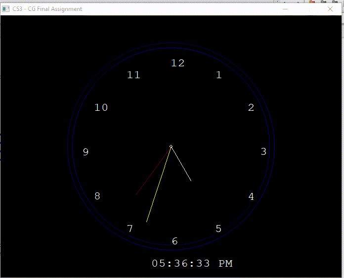

# Cklock

a clock app made using the infamous [graphics.h](https://home.cs.colorado.edu/~main/bgi/doc/index.html) lib

# Preview 

# Note
 - make sure you have [the GCC from tdb (in 32-bit)](https://jmeubank.github.io/tdm-gcc/) set up correctly in your Windows machine. 
 - you would also need ``winmm`` library linked and passed in with the ``-lwinmm`` flag.
 - and finally, it doesn't work on platforms other than Windows. 
